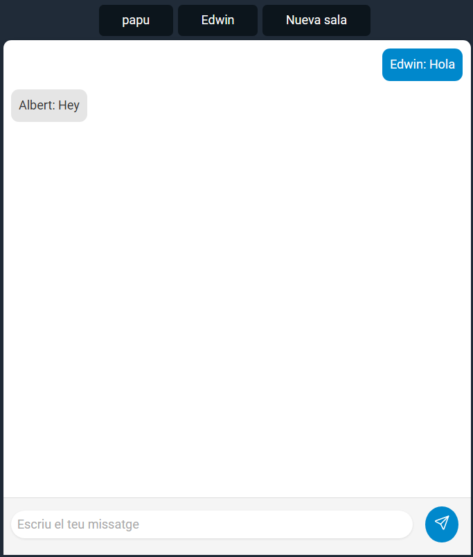

# Chat con Express.js, WebSocket y Node.js

Proyecto de un chat, basado en la interfaz de telegram para hacerlo agradable, además de tener salas multiples además de la inicial,y así conectarse multpiples usuarios a ellas.

## Instalación

1. Clona este repositorio en tu máquina local: https://github.com/EdwinAMV/chat-m5.git

```bash
git clone 
```

2. Entra en el directorio del proyecto:

```bash
cd xat
```

3. Instala las dependencias:

```bash
npm install
```

# Uso

1. Inicia el servidor:

```bash
nodemon server.js
```

2. Abre tu navegador web y visita http://localhost:3000 para acceder al chat.

3. Puedes usar emojis a través de caracteres como ":)" y ":thumbsup:" en tus mensajes. Se convertirán automáticamente en emojis Unicode.

```js
const shortcodeMap = {
        ':)': '😊',
        ':(': '😞',
        ':D': '😃',
        ':O': '😲',
        ';)': '😉',
        ':P': '😛',
        ':|': '😐',
        ':*': '😘',
        '<3': '❤️',
        // etc ..
    };
```

4. Chats agradables, estos tienen censuras en ciertas palabras.
```js
const badWordsMap = {
  puta: "p***",
  cabró: "c****",
  merda: "m****",
  collons: "c******",
  cony: "c***",
  fillputa: "f*******",
  pendejo: "p*****o",
  puto: "p***",
  coño: "c***",
  cabrón: "c*****",
  mierda: "m*****",
  marica: "m*****",
  hijoputa: "h*******",
  // etc ...
```
5. Conectate a diferentes salas, puedes ingresar el nombre de la sala y así conectarte a ella.

## Tecnologías Utilizadas
- Express.js: Framework web para Node.js.
- WebSocket: Implementación de WebSocket para Node.js.
- Node.js: Entorno de ejecución de JavaScript del lado del servidor.
- Nodemon: Herramienta que reinicia automáticamente el servidor cuando se realizan cambios en los archivos.
- Water.css: Un framework CSS mínimo y ligero para comenzar rápidamente sin afectar el estilo predeterminado del navegador.